# ZAlpha 多目标优化算法设计平台
## 版本与改进
----

##　Zalpha v0.0.0.1

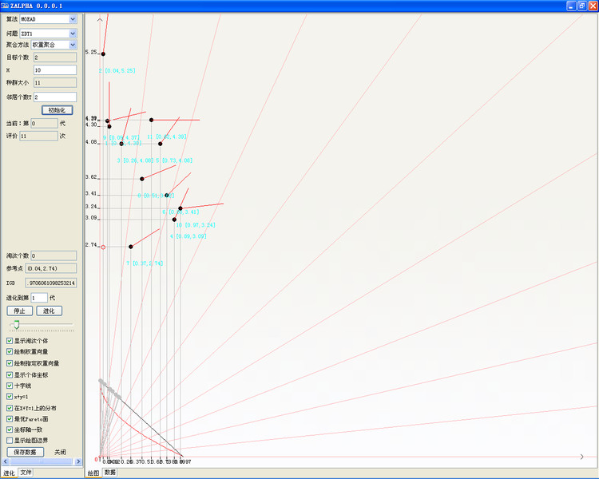

启动后，默认窗口：
左侧设定 算法、测试问题、聚合方法（针对于MOEA/D）、目标个数（选定会测试问题后自动产生，也可以自行修改）、H（MOEA/D专用）、种群大小、邻居个数（针对于MOEA/D） 单击“初始化”，ZALPHA使用设定的参数初始化。

右图显示实时效果：
个体、坐标、设定的进化方向、目前所在的方向、x+y=1参考线及在上面的投影、如果没有最优Pareto面的数据将通过确定性算法计算。

左侧下方：
通过点击按钮实现相应的功能。 支持在算法运行过程中修改聚合方法。手动保存数据。
支持实时IGD评价。

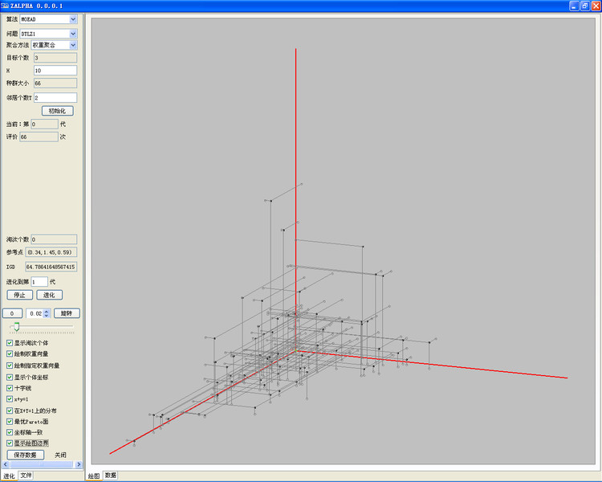

三维效果 支持鼠标拖动旋转，支持自动旋转（左侧按钮）和调整旋转速度。

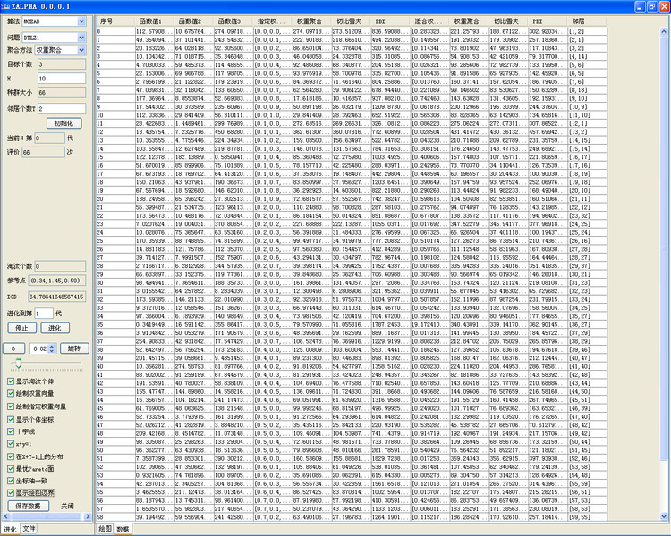

选择下方的“数据”选项卡，实时显示目前个体的函数值、在目标空间的位置、采用不同的聚合函数的数值、邻域个体等

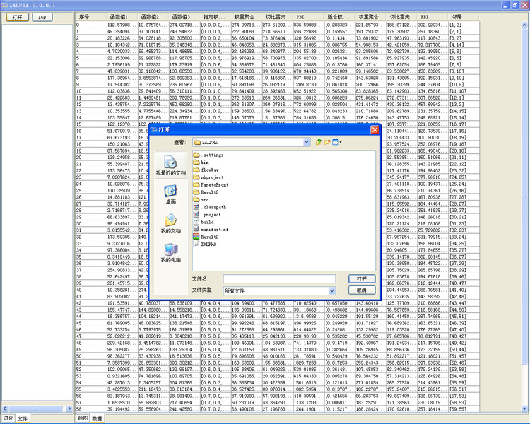

点击左下角的“文件”选项卡。 进行文件显示和评价。点击“打开”，选择显示的文件。

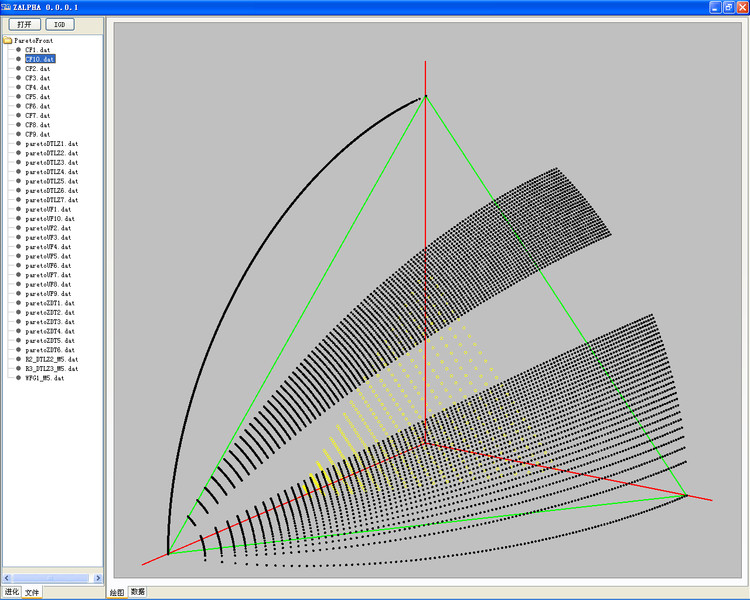

点击IGD按钮，进行选择的文件或者文件夹的IGD评价。  
</td>

## ZALPHA v0.0.0.2

更新日志：

1. 增强对Linux的支持。（文件分割符，算法实验结果文件路径优化管理）

  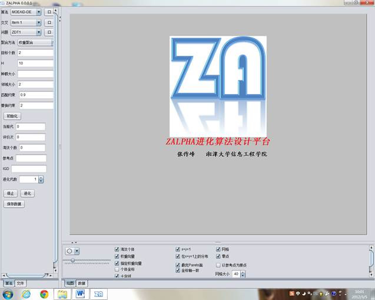

  Windows7

  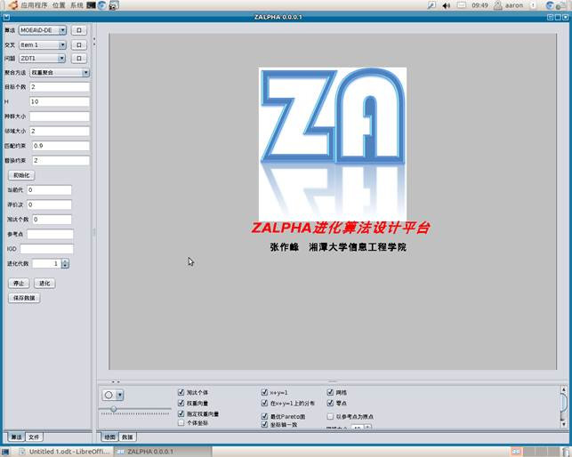

  Linux Gnome 下的界面

  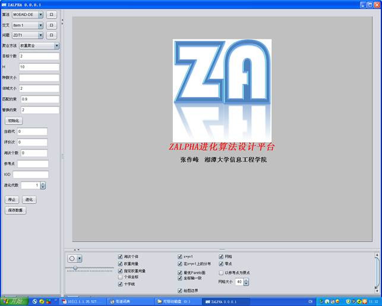

  Windows xp下的界面

2. 增加软件配置记忆。当再次启动文件选择器时记住上次打开的路径。
3. 增加MOEA/D-DE、MOEA/D-DRA、ENS-MOEA/D、MOEA/D-OSD和MOEA/D-AVS算法.
4. 增加实时IGD评价：每进化一代，评价一次IGD。

   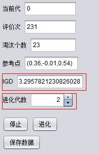
   
5. 界面布局：左侧窗格为算法窗格，下侧为图像控制窗格，可以拖动边界实现隐藏。

  

6. 进化代数输入文本区改为JPinner
7. 绘图区：增加图例，支持实心圆圈、空心圆圈、实心方框和空心方框。
8. 绘图区：增加网格并可以调整网格大小。
9. 绘图区：绘制权重向量是否以坐标原点作为起始点。
10. 绘图区：增加是否显示坐标零点所在区域。
12. 绘图区：调整图像及布局。

  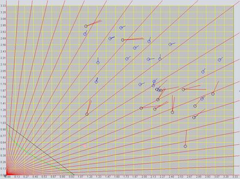

12．文件窗格：增加“打开”-看图，更广泛的格式兼容，可以准确的区分文本文件中的制表符和空格。

  

13. 文件窗格：增加“IGD”-外部文件IGD指标评价。
14. 文件窗格：增加“粘贴”-复制实验数据到粘贴板，即可绘图和保存。单击“粘贴”按钮，弹出TextEditor对话框，确定后即可绘图。

  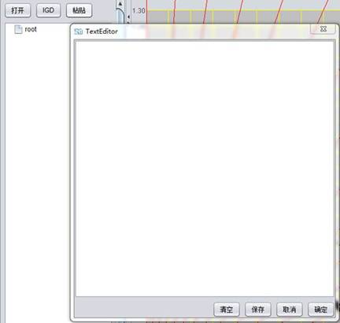  
  
    软件平台与更多工具：
15. 软件风格和主题，一键切换

  

16. 算法模块测试分析

  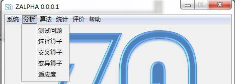

## Zalpha v0.0.0.3
主界面

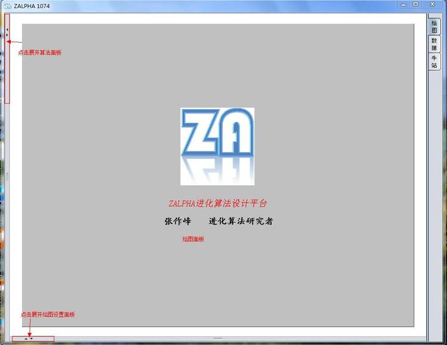

展开后

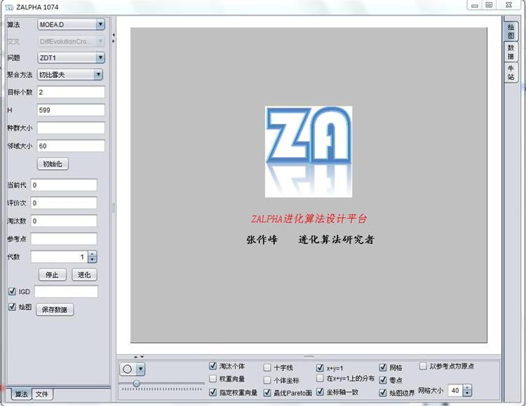

假设选择算法--MOEA/D 问题--ZDT1 聚合方法--切比雪夫 H取19 邻域大小取2 点击初始化（可以选择是否绘图和评价IGD指标）

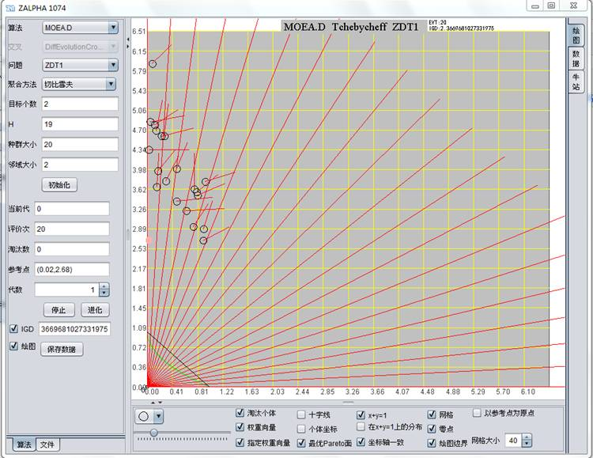

设置进化到5000代，点击“进化”，右侧绘图面板 实时显示当前种群和淘汰种群效果，以及IGD评价指标。

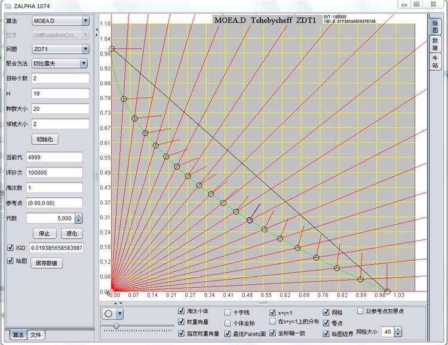

通过绘图设置面板可以调整绘图。如种群序列的形状、大小，网格大小，以及控制某些参考线的显示。

三维情况下，可以使用鼠标拖动图形随机旋转。也可以在绘图设置区域设置图形自动旋转。

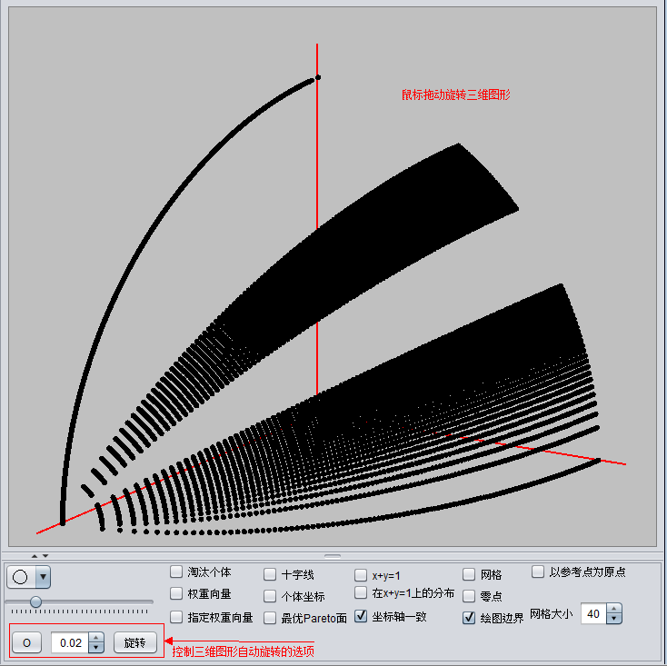

在进化的过程中，点击“数据”选项卡，可以实时显示数据

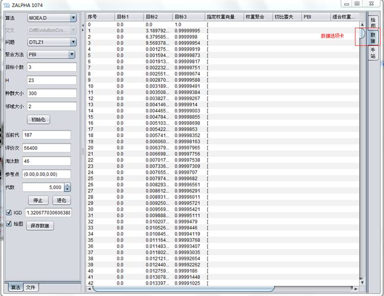

读取文件并绘图的功能：点击左下角的文件选项卡。

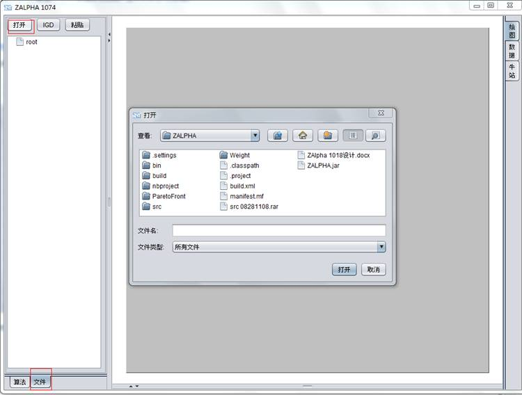  

点击“打开”按钮 选择需要绘图的文件或文件夹，如果选择文件夹，文件列表框中将显示文件夹下的所有文件

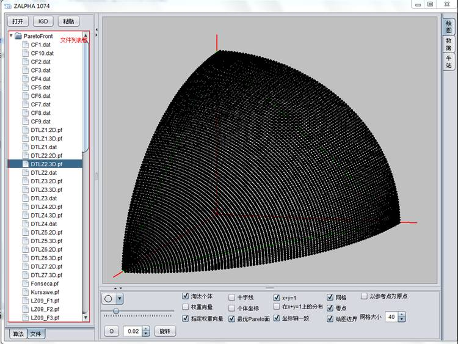

也可以通过粘贴数据绘图，点击上侧的粘贴按钮，弹出“粘贴数据绘图”对话框

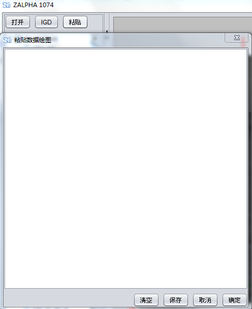

同时支持选择文件评价IGD指标，点击上侧的IGD按钮即可

此外，点击右上角的“牛站”选项卡，收录了目前常用的多目标进化算法的站点（最初是由李密青师兄收集的）

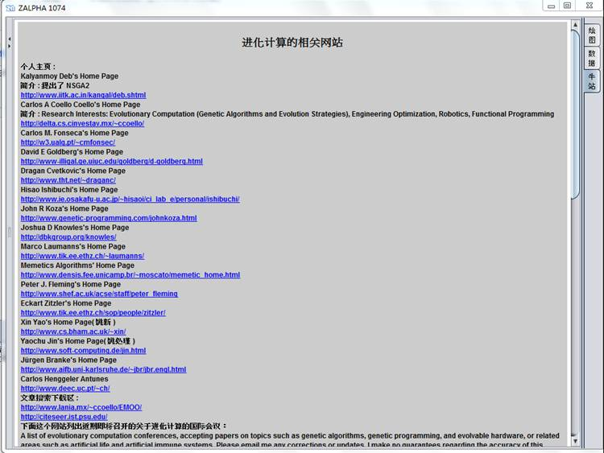

# Zalpha v0.0.0.5
支持同时跑多个算法，只要计算机配置允许可以同时跑任意多个算法。通过“添加”“删除选择”“清空”按钮增添算法。

用于不同算法之间对比，和同一个算法不同参数情况下的对比

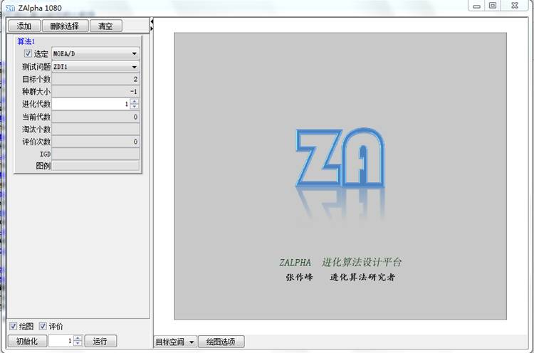

支持设置绘图序列

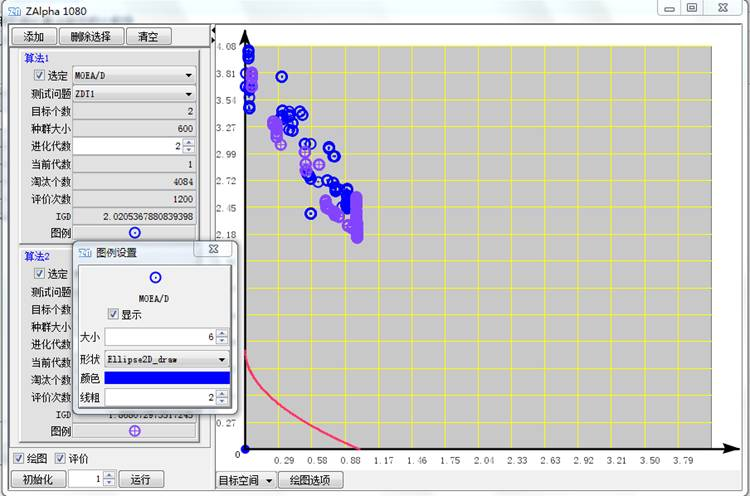

支持绘制收敛曲线

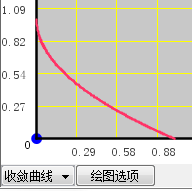

全局绘图设置

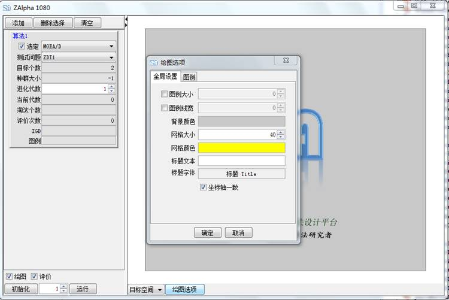

为了方便算法设计过程中算法模块的测试，支持程序方便的调用（SmartDialog）。

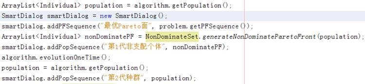

运行结果

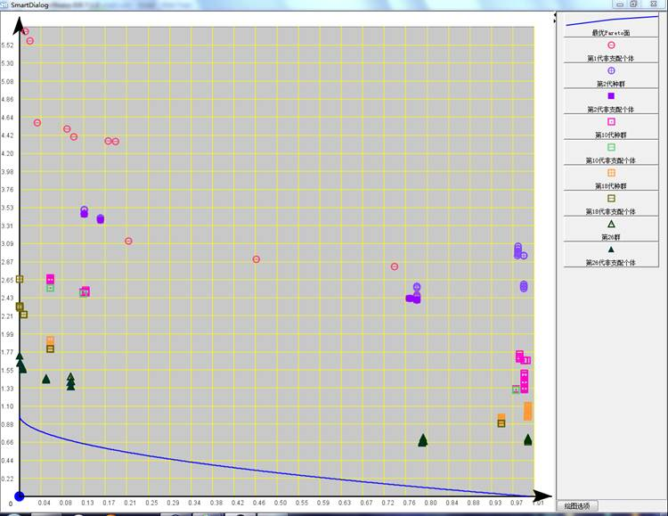

通过右侧的序列面板，可以通过点击序列图形，可以方便的进行设置 
</td>
